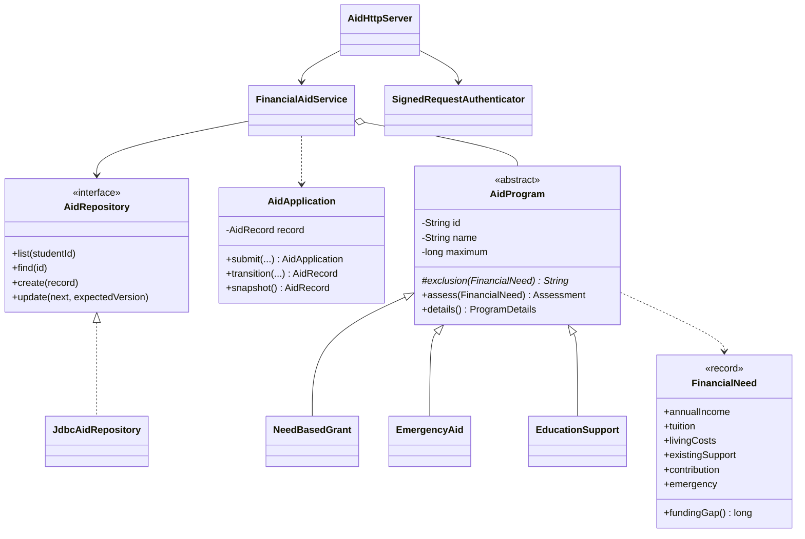
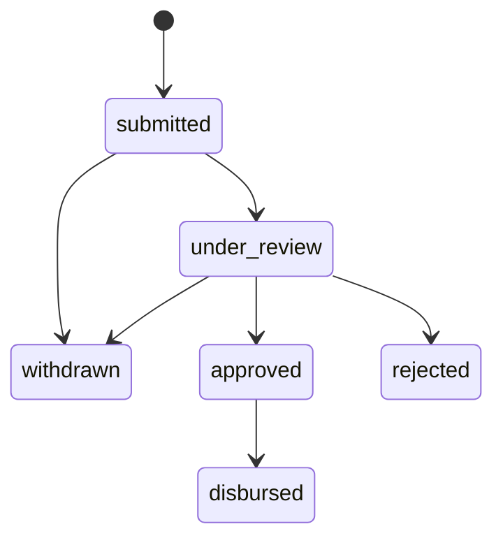

# Scholarship Management and Financial Aid System — Java OOP

The financial aid backend is implemented in Java 17-compatible source under `backend/src/main/java/com/scholarai/aid`. It is called by the running website. TypeScript is used for the retained Next.js UI and server-to-server adapter; it no longer implements the financial aid class hierarchy or business rules.

## Four pillars in Java

| OOP concept | Java implementation | What to demonstrate |
| --- | --- | --- |
| Encapsulation | `AidApplication` owns a private `AidRecord`; `AidProgram` has private final metadata fields | Status can change only through the validated `transition()` method. Returned records and history lists are immutable. |
| Abstraction | Abstract class `AidProgram`; interface `AidRepository` | The service works with contracts, without knowing each eligibility rule or the SQL implementation. |
| Inheritance | `NeedBasedGrant`, `EmergencyAid`, and `EducationSupport` extend `AidProgram` | Every subclass inherits the common `assess()` algorithm and award cap. |
| Polymorphism | `FinancialAidService.assess()` calls `p.assess(need)` for a `List<AidProgram>` | Java dispatches each program's overridden `exclusion()` method at runtime. |
| Composition | `FinancialAidService` receives an `AidRepository` and a list of programs | Independent objects cooperate to implement the application workflow. |
| Interface implementation | `JdbcAidRepository implements AidRepository` | Storage can be replaced without changing service or HTTP controller code. |
| Method overriding | `@Override protected String exclusion(FinancialNeed need)` | Grant, emergency, and education-support eligibility use different rules. |
| Immutability | Java records `FinancialNeed`, `AidRecord`, `Principal`; defensive `List.copyOf` | Application snapshots cannot be altered by UI or service callers. |
| Exception handling | `AidException` carries an expected business failure and HTTP status | Invalid transitions return a useful error rather than changing the stored record. |

## Class diagram

## Running request flow

`React form → Next.js server action → signed HTTP request → Java AidHttpServer → FinancialAidService → domain objects → JdbcAidRepository → H2 file database`

- The existing Supabase session supplies identity in live mode. Demo mode uses the original Aarya persona.
- Next.js signs the identity, HTTP method, path, timestamp, nonce, and body digest with an HMAC secret that never reaches the browser.
- Java rejects unsigned, expired, tampered, and replayed requests.
- Java owns all program metadata, financial-gap calculations, eligibility, submission rules, state transitions, and aid persistence.
- Only admins may review live aid applications. Demo review is explicitly enabled for classroom use and limited to the demo identity's own records.
- Whole-rupee amounts use Java `long`. Fractional, missing, negative, and excessive financial input is rejected.
- SQL uses prepared statements. A student/program unique constraint prevents duplicate applications. Version-checked updates prevent concurrent review overwrites.

## State machine

The application cannot skip review, approve more than requested, withdraw after approval, or record a payment twice. Each successful transition appends an immutable history entry.

## Viva demonstration

1. Install JDK 17+ (JDK 21 LTS recommended), Maven, and Node.js 22+. Run `npm ci` then `npm run dev`.
2. Open the original landing page at `/`, then the student dashboard and Financial Aid from the sidebar.
3. Show the declaration: annual income ₹3,00,000, tuition ₹1,20,000, living costs ₹60,000, confirmed support ₹30,000, contribution ₹20,000.
4. Java returns a funding gap of ₹1,30,000. The grant estimate is capped at ₹1,00,000.
5. Toggle the emergency checkbox to demonstrate subclass-specific eligibility.
6. Submit an application. Open Demo review desk; start review, approve ₹75,000, and record a simulated disbursement reference.
7. Expand Funding declaration & activity. Restart both services and show the record still exists.
8. Open `AidProgram.java` and its subclasses to explain abstraction, inheritance, and polymorphism. Open `AidApplication.java` to explain encapsulation.
9. Run `npm run test:java` for the Java unit, repository, service, and HTTP tests.

## Honest scope

The original scholarship matching engine, authentication, document/AI integrations, and frontend remain in their existing Next.js/TypeScript implementation to preserve ScholarAI features. The new financial aid backend and OOP demonstration are Java. This is not a claim that every original ScholarAI backend feature was rewritten in Java.

Programs are illustrative classroom schemes. Aid documents require human verification; the pre-existing document module is retained but does not automatically approve aid. Disbursement records do not transfer money. Reviewers must reconcile other awards before deciding new support; separate program estimates are not a combined guaranteed award. This version supports one application per student per program, including terminal/rejected/withdrawn records.
